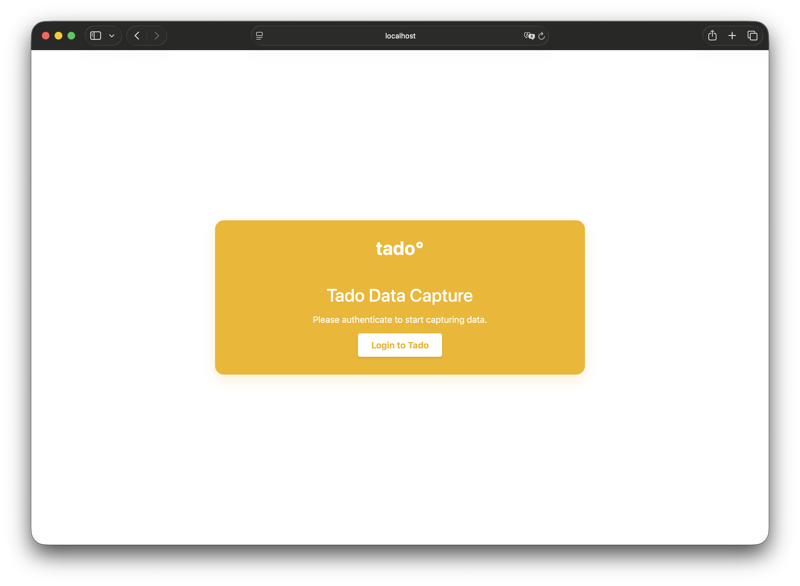

# Tado Data Capture

A Node.js application to capture data from your Tado heating system and store it in InfluxDB.

## Features

- **Tado OAuth2 Authentication**: Safe login via Tado website using Device Flow.
- **Configurable Polling**: Set intervals for Weather, Rooms, and Heat Pump.
- **InfluxDB Integration**: Stores all metrics in InfluxDB for visualization (e.g., Grafana).
- **Dockerized**: Easy deployment with Docker Compose.
- **Enhanced Dashboard**: Real-time connected status, polling intervals, and next poll countdowns.
- **Dry Run Mode**: Test without writing to InfluxDB.

## Screenshots

| Login View | Dashboard View |
|:---:|:---:|
|  |  |


## Getting Started

### Prerequisites

- Docker & Docker Compose
- Tado Account
- InfluxDB Instance

### Setup

1. Clone the repository.
2. Copy `.env.example` to `.env` and fill in your details:
   ```bash
   cp .env.example .env
   ```

3. Create an empty `token.json` file in a `data` directory (required for Docker persistence):
   ```bash
   mkdir data
   echo "{}" > data/token.json
   ```

### Running with Docker

```bash
docker compose up -d
```

The app will be available at `http://localhost:3000`.

### Running Locally

```bash
npm install
npm start
```

## Usage

1. Open `http://localhost:3000`.
2. Click **Login to Tado**.
3. Follow the instructions to authorize the device.
4. Once authenticated, the dashboard will show status and API call counts.
5. Data will automatically start flowing to InfluxDB based on your configured intervals.

## Configuration

See `.env.example` for all available options.

| Variable | Description |
|----------|-------------|
| `TADO_DRY_RUN` | Set to `true` to disable InfluxDB writes. |
| `TADO_POLL_INTERVAL_...` | Polling intervals in milliseconds (`WEATHER`, `ROOMS`, `HEATPUMP`, `DEVICES`). |
| `INFLUX_...` | InfluxDB connection details. |
| `TADO_LOGIN_PORT` | Port for the web interface. |
